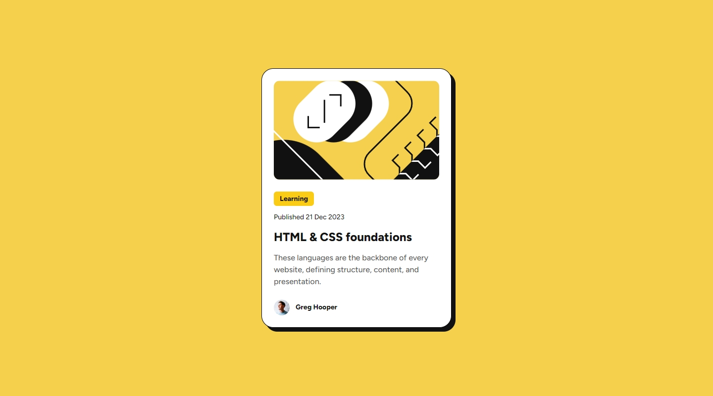
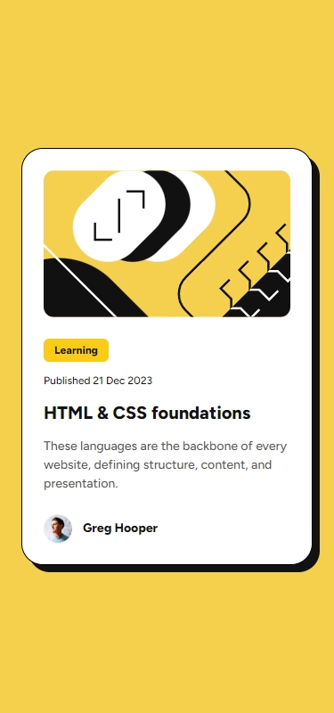

## Frontend Mentor Challenge 15 - Blog Preview Card

This is my solution to the [Blog Preview Card](https://www.frontendmentor.io/challenges/blog-preview-card-ckPaj01IcS) challenge on [Frontend Mentor](https://www.frontendmentor.io/).

### Screenshots of the Solution (Desktop & Mobile). 🔍




#

### Links. 🔗

- Live Site URL: https://blog-preview-card-darkstarxdd.vercel.app/

#

### Built with. 🔨

- HTML.
- Tailwind.
- Vite.

#

### Features. ✨

- The requirements of the project stated that the font sizes need to slightly change with the screen size, but without using media queries. So I used the `clamp()` function on the font size.
  ```css
  .text-clamp-100 {
    font-size: clamp(0.75rem, 2vw, 0.875rem);
  }
  ```

#

### Testing and Accessibility. 🧪

- Used the Responsively App to check how the site looks on various screen sizes, starting from 320 x 480 and going up to 3000 x 2000.
- Using Firefox on desktop, changed the browser font size to extreme low and high values (9px to 56px respectively).
- Zoom the page in and out using Ctrl + Scroll wheel.
- Tested using NVDA screen reader.
- Viewed the site on an iPhone 11.
- Performed Lighthouse and PageSpeed tests. ([PageSpeed Result.](https://pagespeed.web.dev/analysis/https-workit-landing-page-darkstarxdd-vercel-app/7ylu6a0i49?form_factor=mobile))

#

### New Things Learned. 🎓

- Tailwind. It's my first time using Tailwind, so I had to learn how to setup a project with it. Had to search in the [Tailwind docs](https://tailwindcss.com/) a bit to find some class names. The [Tailwind CSS IntelliSense](https://marketplace.visualstudio.com/items?itemName=bradlc.vscode-tailwindcss) VS Code plugin was super helpful since it shows the underlying CSS properties for each utility class.
- Also learned a bit about how to use `tailwind.config.js` file to extend the default theme to include my own custom values.
- Using `@layer` to include my own classes.

#

### Ending Notes. 📝

- I am not entirely sure how much I like using Tailwind yet. This was only a very small project. I still enjoy creating all my classes and variables from scratch. Maybe on bigger projects Tailwind shows it's true power.

#

### Tools I Use. 🔧

- [Prettier VS Code Extension](https://marketplace.visualstudio.com/items?itemName=esbenp.prettier-vscode) - Code formatter.

- [Responsively.app](https://responsively.app/) - A free and open source tool that allows you to test your webpage on different screen sizes, take screenshots and much more.

- [Color Contrast Checker by coolors.co](https://coolors.co/contrast-checker/112a46-acc8e5) - Check color contrast ratios and if needed, update the colors to match the WCAG guidelines.

- [Google Webfonts Helper by Mario Ranftl](https://gwfh.mranftl.com/fonts) - Provides WOFF2 format for Google Fonts.

- [PerfectPixel by WellDoneCode](https://chromewebstore.google.com/detail/perfectpixel-by-welldonec/dkaagdgjmgdmbnecmcefdhjekcoceebi) - A chrome extension that enables you to overlay an image, over a webpage. This makes it easier to compare your solution result with the reference image and adjust fine details if needed.

#

- My Frontend Mentor Profile - [@DarkstarXDD](https://www.frontendmentor.io/profile/DarkstarXDD)
